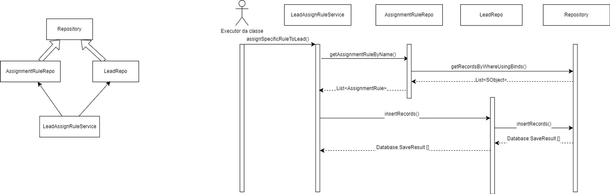

# 1. Objetivo

Apresentar a solução para criar regras de distribuição de leads específicas de acordo com uma regra já criada sem ser o padrão.

---

# 2. Objetos trabalhados

- Lead
- AssignmentRule
- Queue

---

# 3. Solução

## 3.1 - Criar uma fila para atribuir o registro que está sendo criado.

Para criar uma fila para o registro de Lead que está sendo criado basta ir em Setup → Queues → New

1. Informe a Label que você gostaria e a Queue Name.
2. Em **Available Objects selecione o objeto Lead e clica na seta para adicionar a lista de Selected Objects**
3. Na seção de **Queue Members, selecione os usuários que estarão responsáveis por atuar na fila.**

Após criar a fila vá para a etapa de criar uma regra de atribuição de Lead.

---

## 3.2 - Criar regra de atribuição de Lead.

Para criar uma regra de atribuição de Lead vá em **Setup** → **Lead Assignment Rules → New**

1. Informe o nome da regra
2. Informe se está ativa ou não, caso essa opção seja marcada a nova regra que está sendo criada será a padrão ( OBS: Só é possível ter uma regra ativa por vez).
3. Deixe essa opção desmarcada.
4. Na seção de Rule Entries da regra de atribuição que acabou de ser criada, clique em new.
5. Informe a ordem de execução da regra, utilize o padrão 10, 20, 30.
6. Informe os critérios para a entrada.
7. Na etapa 3, escolha a opção queue e selecione a fila que foi criada no 3.1

Pronto, agora que sua regra está criada e bem configurada ela pode ser utilizada pelo serviço de atribuição de regras.

---

## 3.3 - Utilizando o serviço Apex para atribuir Leads.

Para utilizar o serviço de atribuição de Leads basta criar uma instância da classe *LeadAssignRuleService* e chamar o método *assignSpecificRuleToLead* passando o nome da regra de atribuição de Lead e os registros que você está criando para a regra.

Como exemplo temos o seguinte script.

```java
List<Lead> leads = new List<Lead>();

// Criando o Lead.
leads.add(new Lead(LastName = 'Teste', Company = 'Teste', City = 'Fortaleza'));

// Chamando o serviço.
// Lead Test -> Nome da regra de atribuição
// leads -> Registros que serão criados com a regra.
new LeadAssignRuleService().assignSpecificRuleToLead('Lead Test', leads);
```

---

# 4. Motivos para utilizar a Regra de Atribuição de Lead.

Esses são os seguintes motivos para utilizar a regra de atribuição de Lead, em vez de fazer tudo por código.

1. Fácil manutenção dos filtros de quais Leads serão atribuídos para qual fila.
2. Possibilidade de enviar um email para os usuários da fila sempre que alguma atribuição for setada em um Lead.
3. Fácil manutenção de quais usuários irão atuar naquele respectivo Lead.
4. Fácil integração com outras ferramentas do Salesforce, como web-to-lead.

---

# 5. Observações a mais

1. Para fazer que a notificação por email funcione, é necessário ir em Lead Settings ativar a flag **Notify Default Lead Owner e Notify New Lead Owner When Updated via APEX,** desta ****forma será possível que o serviço execute de maneira apropriada.

---

# 6. Definições técnicas

## 6.1 - Arquitetura da solução



---

## 6.2 - Lista de classes utilizadas

- Repository
- AssignmentRuleRepo
- LeadRepo
- LeadAssignRuleService

---

## 6.3 - Objetos do salesforce utilizados

- AssignmentRule
- Lead

---

## 6.4 - Classes de testes

- RepositoryTest
- AssignmentRuleRepoTest
- LeadRepoTest
- LeadAssignRuleServiceTest

---

# 7. Referências

https://developer.salesforce.com/docs/atlas.en-us.apexcode.meta/apexcode/langCon_apex_dml_database_dmloptions.htm

https://developer.salesforce.com/docs/atlas.en-us.apexref.meta/apexref/apex_methods_system_database.htm

https://eufacoprogramas.com/diagramas-uml-resumo/